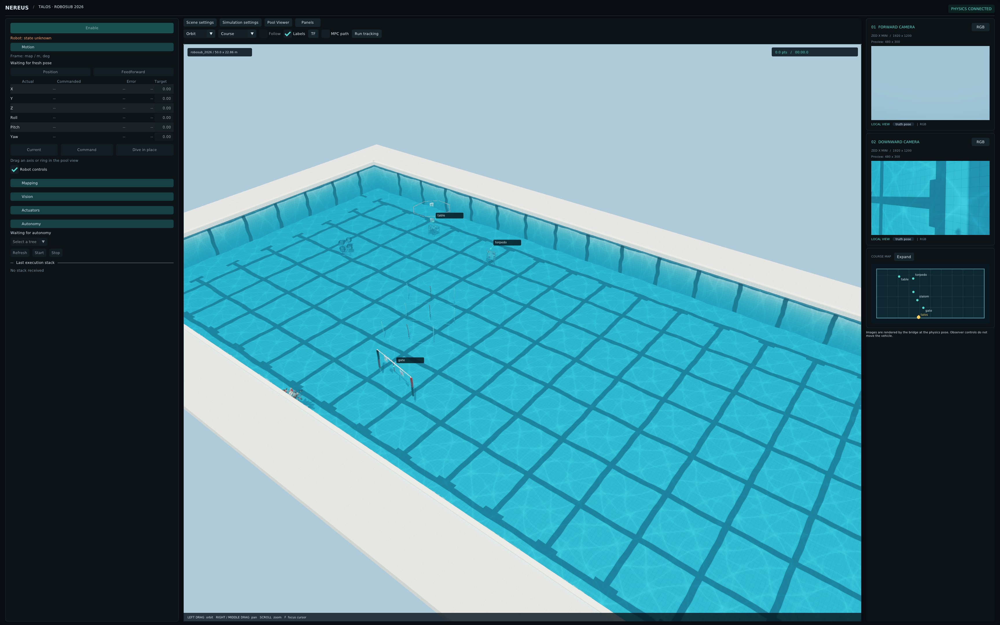

# Nereus

A config-driven underwater robot simulator and operator interface, built to test a real ROS 2 robot stack
unchanged. Describe your robot, pool, course and ROS topics in YAML; the simulator publishes what your robot's
sensors and cameras would, takes your controller's thruster commands, and scores the run. The same viewer drives
the real robot.



- **Simulator** (`nereus-sim`): 6-DOF marine dynamics, delayed thrusters, IMU/FOG/DVL/depth, stereo
  cameras with depth and point clouds, claw/launcher/dropper/magnet mechanisms, contact props (Bullet), task
  scoring. C++, runs at real time with cameras.
- **Pool viewer** (`nereus-viewer`): 3D scene, camera cards, motion control, autonomy, mapping,
  detections and point clouds, run scorecard. Works against the simulator or a real robot.
- **Packs**: all robot/pool/course/bridge data lives in `content/packs/`; nothing about your robot is in code.

## Setup

Tested on Ubuntu 22.04 with ROS 2 Humble.

```sh
# System libraries
sudo apt install cmake g++ libeigen3-dev libyaml-cpp-dev nlohmann-json3-dev libgtest-dev \
  libbullet-dev libassimp-dev libglfw3-dev libglew-dev libegl-dev libpng-dev libjpeg-dev libopencv-dev
# Pack tools (validation and resolving)
pip install numpy "ruamel.yaml>=0.18" jsonschema referencing

# Build (with ROS 2 and your robot workspace sourced; the UWRT integration needs riptide_msgs2)
source /opt/ros/humble/setup.bash && source ~/osu-uwrt/release/install/setup.bash
cmake --preset ros-viewer
cmake --build --preset ros-viewer -j4
```

`COLCON_IGNORE` keeps colcon out of this folder; everything builds into `build/`. Use `-j2` on machines with
little memory.

## Run

```sh
# Simulator + UWRT stack + viewer
ros2 launch integrations/uwrt/launch/sim.launch.py
#   stack:=false  viewer:=false  cameras:=false  rmw:=rmw_zenoh_cpp
#   active_control_model:=mpc mpc_model:=sim     (MPC controller on the simulator plant)

# Viewer against the real robot (no simulator)
ros2 launch integrations/uwrt/launch/robot.launch.py
#   robot_only:=true  (hide the simulated pool)   rmw:=...   config:=<viewer host yaml>
```

The launch files use your shell's RMW; UWRT runs Zenoh (`ros2 run rmw_zenoh_cpp rmw_zenohd`). Run records
(resolved scenario, performance, task events) go to `/tmp/nereus_sim/<timestamp>/`. A run waits for **Start
run** in the viewer before scoring.

## How it fits together

```
content/packs/scenarios/<name>/scenario.yaml   picks a robot, pool, tasks and bridge; places the course
   ├── robots/<robot>/robot.yaml     physics, frames, thrusters, sensors, mechanisms, visuals
   ├── pools/<pool>/pool.yaml        pool size, walls, water, lighting
   ├── tasks/<set>/tasks.yaml        task files, scoring rules, scorecard UI
   ├── bridges/<bridge>/bridge.yaml  ROS topics, services, TF and message field mapping
   └── equipment/<team>/equipment.yaml  optional team gear the scenario places (UWRT: the AprilTag board)
        │  python -m nereus.packs resolve   (validates, writes one resolved.json)
        ▼
nereus-sim resolved.json  ◄── ROS 2 ──►  your robot stack   ◄── ROS 2 ──►  nereus-viewer
```

| Folder | Contents |
| --- | --- |
| `content/packs/` | Robot, pool, task, bridge, equipment and scenario packs (the config you edit) |
| `content/viewer/` | Viewer layout, panels and topics |
| `libraries/` | C++ simulation, sensors, session (tasks, props), rendering, cameras |
| `integrations/ros2/` | Simulator bridge and pool viewer |
| `integrations/uwrt/` | UWRT launch files and acceptance scripts |
| `extensions/rules/` | Competition scoring rules (C++) |
| `python/` | Pack tools: validate and resolve packs |

## Guides

- [Using the viewer](docs/viewer.md)
- [Adding a robot](docs/guides/robot.md)
- [Pool and course layout](docs/guides/course.md)
- [Tasks and scoring](docs/guides/tasks.md)
- [Wiring your ROS stack](docs/guides/bridge.md)
- [Synthetic datasets](docs/guides/datasets.md)

Check a pack after editing:

```sh
PYTHONPATH=python/src python3 -m nereus.packs validate content/packs/scenarios/talos_uwrt
```

## Known limitations

- Acoustics aren't simulated: there is no pinger, so the random-pinger tasks can't score.
- The coin flips and the manual score adjustment are set by the operator in the Run panel; there
  is no session countdown or automatic time bonus.
- The plant is a model of Talos. Controller gains tuned in the simulator don't carry over to the
  real robot; tune those in the pool.

## Tests

```sh
ctest --test-dir build/ros-viewer -LE live -j2          # C++ (run a subset with -R <name>)
cd tests/python && PYTHONPATH=../../python/src python3 -m pytest -q
```

## License

Apache License 2.0; see [LICENSE](LICENSE) and [NOTICE](NOTICE). Bundled Dear ImGui and GLM keep their MIT
licenses.
