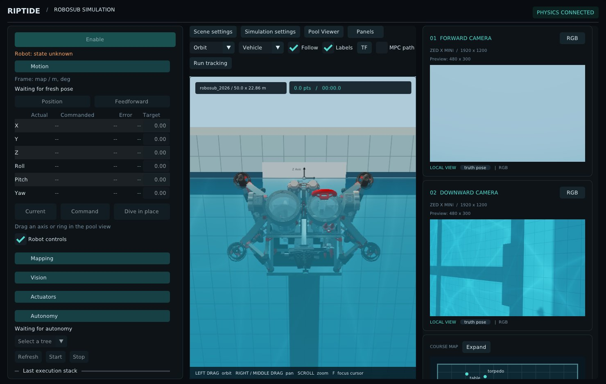

# Using the viewer

`nereus-viewer` is the operator interface for both the simulator and the real robot. The sim launch
starts it for you; for the real robot use `ros2 launch integrations/uwrt/launch/robot.launch.py`.

- **Top bar**: view, focus and display toggles.
- **Left sidebar**: robot control panels (Motion, Mapping, Vision, Cameras, Electrical, Actuators, Autonomy). Click a header
  to fold it.
- **Centre**: the 3D scene. The pill at the top right says where the robot pose comes from (`PHYSICS CONNECTED`
  in sim, `ROBOT (ESTIMATE)` on the real robot).
- **Header chips**, left of that pill: the FOG and CPU temperatures and both batteries' charge (see below), and a
  red `REC` chip per camera while it records.
- **Right**: camera cards and the course map.

## Moving around

| | |
| --- | --- |
| Left drag | orbit |
| Right / middle drag | pan (detaches Follow) |
| Scroll | zoom |
| `F` | focus on the point under the cursor |
| `F3` | frame-time stats |
| View → *Free camera* | click for mouse look, `WASD` move, `Space`/`Shift` up/down, `Ctrl` fast, `Esc` release |
| View → *ffc* / *dfc* | look through a robot camera |

**Focus** jumps to the vehicle, a mechanism (Claw, Payloads) or a course element; **Follow** keeps the camera on
the robot. **Labels** names course elements; **TF** draws frame axes; **MPC path** draws the MPC's predicted path;
**Thrust** draws the commanded thruster forces (`thruster_forces`) as red arrows from each thruster along its axis,
like RViz's thruster wrenches (0.05 m per newton; nothing while the controller is not publishing).

## Robot temperatures and batteries

The header chips show the FOG temperature (`gyro/status`) and the hottest CPU core (the computer monitor's
`Core Temperature` in `/diagnostics_agg`): cyan is fine, amber a warning (FOG 55 °C, CPU 70 °C), red an error (FOG
75 °C, CPU 85 °C, or a fault the FOG driver or the computer monitor reports). Grey means no data: never received,
or nothing for 2 s (FOG) / 10 s (CPU), when the last value stays shown. Hover a chip for the details.

`PORT` and `STBD` are each battery's state of charge (`state/battery`), as in the RViz overlay: amber below 50 %,
red below 20 %, grey after 10 s without a reading. Hover for the pack voltage, current, time to discharge and
cell. In sim none of these publishers run, so all four chips stay grey.

## Driving the robot (Motion)

1. **Enable**. The enable latches: the robot keeps running if the viewer closes or the tether drops. **KILL** (or
   the physical kill) stops it.
2. Pick **Position** or **Feedforward**.
3. Drag the gizmo in the 3D view (arrows move, rings rotate; `Esc` during a drag restores the start), or type a
   target in the table and press **Command**. **Current** copies the robot's pose into the table; **Dive in
   place** targets the current x/y and heading, level, at the configured depth (`dive_z`).

If the viewer freezes or the pose goes stale, it releases manual control and the robot holds its last command;
it never kills on its own. Another operator sending on the same kill switch (for example RViz's control panel)
does kill: use one operator at a time.

## Autonomy, Mapping, Actuators

- **Autonomy**: pick a tree, **Start** / **Stop**; the execution stack shows the running nodes. Manual control is
  blocked while a tree owns the robot.
- **Mapping**: tag calibration, reset, and the mapping target (**Lock map**).
- **Actuators**: arm/disarm, fire torpedoes, drop markers, open/close the claw, reload.

## Cameras

- **SVO recording**: the path is on the robot (`~` is `/home/ros`). Each camera records to its own file,
  `<path>_<date>_<time>_<camera>.svo2` (untick *Add date and time* to drop the timestamp). **Start** calls the ZED
  node's `start_svo_rec` (lossless); **Stop** calls `stop_svo_rec`. The viewer knows only the recordings it
  started, so **Stop** works whenever the service is up, including for a recording started before a restart.
  Starting needs `zed_msgs` when the viewer is built; without it the panel says so and only Stop works.
- **Capture image**: the picture taker (`capture_image`) saves the newest front camera frame on the robot; the
  reply lists the saved files.

## Electrical

The RViz electrical panel's tools, on the real robot:

- **Power**: one button per `command/electrical` command. The red ones (cycle computer, cycle robot, kill robot
  power) ask for confirmation first.
- **IMU (VectorNav)**: **Mag cal** runs the driver's calibration (turn the robot slowly through every orientation;
  the bar fills as the deviation shrinks), **Cancel** stops it. Register edit: type a register number, **Read**
  fills the value, **Write** sends the value, **Save to flash** keeps the settings across power cycles.
- **FOG**: **Tare gyro** with the sample count and timeout; hold the robot still. An aborted tare shows why.
- **Pinger**: the enable state is re-sent every second, as RViz did, so a rebooted board picks it up. The
  frequency buttons choose the broker's frequency; the highlighted one is what the board reports.
- **IVC**: send a status (first two headers) or a raw 0-31 command (other headers); the log shows sends, receives
  and acknowledgements with their decoded names.

Topics, the command list and the IVC names are in the `electrical` provider of `talos_uwrt_panels.yaml`.

## Vision

- **Detections**: the detector's markers, placed where the object was seen. *Placement* (sim only) chooses
  simulator truth, the localization estimate, or both. *Keep detections* lets markers live out their lifetime
  instead of clearing each frame.
- **Point clouds**: one checkbox per cloud in the viewer config (YOLO detections, front and down camera); a cloud
  is only subscribed while its box is ticked. Newest message only, like RViz.

## Camera cards

**RGB / DEPTH** switches the image. In sim the label under the image is a button: **truth pose** shows the
viewer's own render from the true camera pose (fast, no noise); click it for **ROS (stack)**, the images your
stack actually receives.

## Pool Viewer menu

- **Water, Pool walls & deck, Pool floor, Surface reflections**: visibility (camera cards always see the pool).
- **Course**: *Auto* shows the simulator's course in sim and the mapping estimate on the real robot; *Mapping
  (RViz)* draws `riptide_meshes` models at the mapping TF frames, exactly as RViz does. *Mapping ghost* (sim)
  overlays the mapping estimate translucent on the true course. *Meshes* lists every mapping mesh by its TF frame:
  untick one to hide it (course and ghost alike); `mapping_markers.hidden` in the host config sets which start
  hidden.
- **Localization estimate** (sim only): *Robot ghost* draws the EKF estimate as a translucent robot. *Control
  gizmo* and *Follow* each centre on the estimate or the true robot. Commands always go to the controller in its
  estimate frame.
- **Lighting**: the observer's lighting, independent of what the cameras see. *Team equipment* hides the
  scenario's equipment pack (the calibration board) in this view only; camera cards always show it.

**Scene settings** has the simulator's mechanism buttons, lighting and water appearance; **Simulation settings**
sets the speed (pause, 1x, faster), **Sync sim** to the estimate and **Reset sim**.

## Scoring a run (sim)

Open **Run tracking**:

1. Set the run options (coin-flip role, heading and role coin flips) and **Start run**. The timer runs on
   simulation time; **Stop run** ends it.
2. The status lines show the role of the gate side the robot took and the coin-flip bonuses earned.
3. **Score adjustment**: type a signed amount and **Add** for subjective points; **Clear** removes them.
4. **Reset run & tasks** puts every prop and payload back.

A rejected command (for example Start while a run is running) shows as *Command rejected: ...*.

## Configuration

All of it is YAML in `content/viewer/`:

| File | Controls |
| --- | --- |
| `talos_uwrt_host.yaml` | topics, pose source and delays, estimate ghost/anchors, detections, `point_clouds`, `mapping_markers`, `thrust_arrows`, focus presets |
| `talos_uwrt_panels.yaml` | `toolbar:`, `header:` and sidebar `panels:` (order, titles, which are open), and the providers they talk to (telemetry readings and thresholds, recording services) |
| `talos_uwrt_thruster_visuals.yaml`, `talos_uwrt_status_lights.yaml` | rotor animation and LED bars |

Toolbar, header and sidebar items are listed by type; reorder or remove entries to change the layout. For command-line
options run `build/ros-viewer/nereus-viewer --help`.
